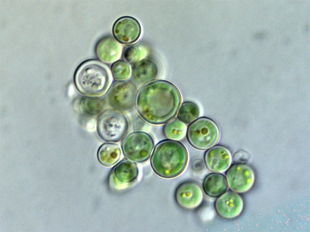

```{r setup, include=FALSE}
knitr::opts_chunk$set(echo = FALSE)
```



Source of the article : <https://elifesciences.org>

Link of the article : <https://elifesciences.org/articles/48999>

Date of publication : 15/07/2019

Word count : 729

## Vocabulary 

| Words from the text | Synonym/Explanation |
| ------------------- | ------------------- |
| facilitating        | making easier       |
| therefore           | as a consequence    |
| criterion           | standard            |
| to yield            | to submit           |
| symbiont            | symbiotic organism  |

## Analysis table 

|                       |                                                                                                                                                                                                                                                                                                                                                                                                                                       |
| --------------------- | ------------------------------------------------------------------------------------------------------------------------------------------------------------------------------------------------------------------------------------------------------------------------------------------------------------------------------------------------------------------------------------------------------------------------------------- |
| Author                | Karolin M Kobras & Daniel Falush, Milner Centre for Evolution, University of Bath UK                                                                                                                                                                                                                                                                                                                                                  |
| Researchers           | Karolin M Kobras, Daniel Falush, JA Heinemann, GF Sprague, F Husnik, JP McCutcheon, EV Koonin, KS Makarova, L Aravind, C Ku, WF Martin, J Lee et al., O Popa, G Landan, T Dagan, AW Rossoni et al., SL Salzberg, G Schönknecht et al., M Touchon et al.                                                                                                                                                                               |
| Published in ? When ? | eLife Sciences, 15/07/2019                                                                                                                                                                                                                                                                                                                                                                                                            |
| General topic         | Study of the gene transfer process in red algae, which  is an important vector of adaptation as it allows prokaryotes to acquire the genes they need to grow in specific environments.                                                                                                                                                                                                                                                |
| Procedure             | Analysis of the genomes of red algae Cyanidiales and other prokaryotes living in the same extreme environments.                                                                                                                                                                                                                                                                                                                       |
| Conclusion            | It has been found the 1% of the Cyanidiales genome had been obtained via HGT, and prokaryotes adapted to the same extreme environment as Cyanidiales were identified as the source of these genes. Furthermore, certain of these genes code for proteins that are needed to survive in extreme environments.                                                                                                                          |
| Remaining questions   | Researchers still don't know how these transfers took place. But the hypothesis saying that DNA is obtained via plasmids or viral infections remains the most plausible.  But even in this case, some questions remain unanswered : "What are the most common modes of plasmid transmission in Cyanidiales ? How do plasmids maintain themselves in populations ? How often do they jump between species, and how far do they jump ?" |
