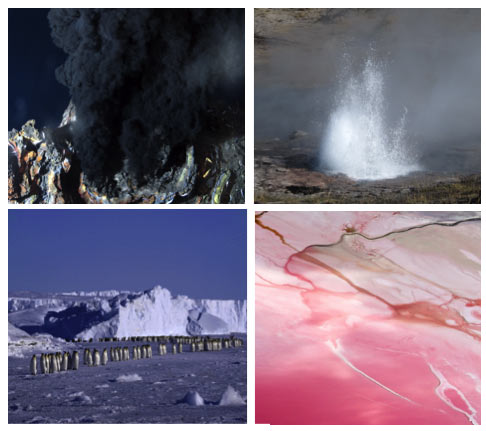

```{r setup, include=FALSE}
knitr::opts_chunk$set(echo = FALSE)
```



Source of the article : <https://www.encyclopedie-environnement.org>

Link of the article : <https://www.encyclopedie-environnement.org/en/life/microbes-in-extreme-environments/>

Date of publication : 23/04/2019

Word count : 2524

## Vocabulary 

| Words from the text | Synonyms/Explanation                    |
| ------------------- | --------------------------------------- |
| to exploit          | use to advantage                        |
| sustainable         | bearable, tolerable                     |
| reservoir           | a large supply                          |
| partial             | not complete                            |
| astonishing         | amazing                                 |
| negligible          | insignificant                           |
| constraint          | limit                                   |
| sought              | past tense of seek                      |
| biased              | prejudiced                              |
| homologous          | similar                                 |
| piezophiles         | need pressures exceeding 20 MPa to grow |
| psychophiles        | only thrive below 15°C                  |
| nevertheless        | however                                 |
| halophiles          | can resist severe dehydration           |
| arid                | dry                                     |
| brine               | salty water                             |
| compartmentalize    | arrange in sections                     |
| to trigger          | to provoke                              |
| to stiffen          | to make stiff, hard                     |
| halophiles          | thrive in a high salt concentration     |
| robustness          | strength                                |
| uniqueness          | fact of being unlike anything else      |
| screening           | selection                               |
| counterpart         | equivalent                              |

## Analysis table

|                          |                                                                                                                                                                                                                                                                                                                                                                                                                                                                                                                                                                                                                                                                                        |
| ------------------------ | -------------------------------------------------------------------------------------------------------------------------------------------------------------------------------------------------------------------------------------------------------------------------------------------------------------------------------------------------------------------------------------------------------------------------------------------------------------------------------------------------------------------------------------------------------------------------------------------------------------------------------------------------------------------------------------- |
| Author                   | Bruno Franzetti, Research director at the CNRS, Institut de biologie structurale, Université Grenoble Alpes                                                                                                                                                                                                                                                                                                                                                                                                                                                                                                                                                                            |
| Researchers/Contributors | Abdoun E, Banik JJ & Brady SF, Cowan DA et al., Gribaldo S et al., Forterre P, Gribaldo S et al., Brochier-Armanet C, Oger P & Franzetti B, ebbar M et al., Cavicchioli R et al., Oren A, Inagaki F et al., McKay CP, Coquelle N et al., Madern D et al., Vauclare P et al., Raddadi N et al.                                                                                                                                                                                                                                                                                                                                                                                          |
| Published in ? When ?    | Encyclopedia of the environment, 23/04/2019                                                                                                                                                                                                                                                                                                                                                                                                                                                                                                                                                                                                                                            |
| General topic            | Study and observation of extremophilic microorganisms in order to comprehend how specific proteins and mechanisms allow them to thrive in extreme environments that are lethal to any other form of life.                                                                                                                                                                                                                                                                                                                                                                                                                                                                              |
| Procedure                | Different topics are discussed in this article : the biodiversity of extremophilic microorganisms, the discovery of the archea, the preservation of their biological functions and the usefulness of their enzymes in biotechnologies                                                                                                                                                                                                                                                                                                                                                                                                                                                  |
| Conclusion               | Archea play important roles in the regulation of major geochemical cycles and potentially constitute a reservoir of new biocatalysts for future technologies ; indeed their contribution to the production of greenhouse gases, and to the major carbon, nitrogen and nitrate cycles, is far from negligible. Enzymes are natural products that perform chemical reactions in an ultra-efficient and non-polluting way. Indeed, their robustness, their ability to perform chemical reactions under extreme conditions and sometimes the uniqueness of the chemical reactions they perform make them very interesting for multiple applications, such as biotechnologies for example.  |
