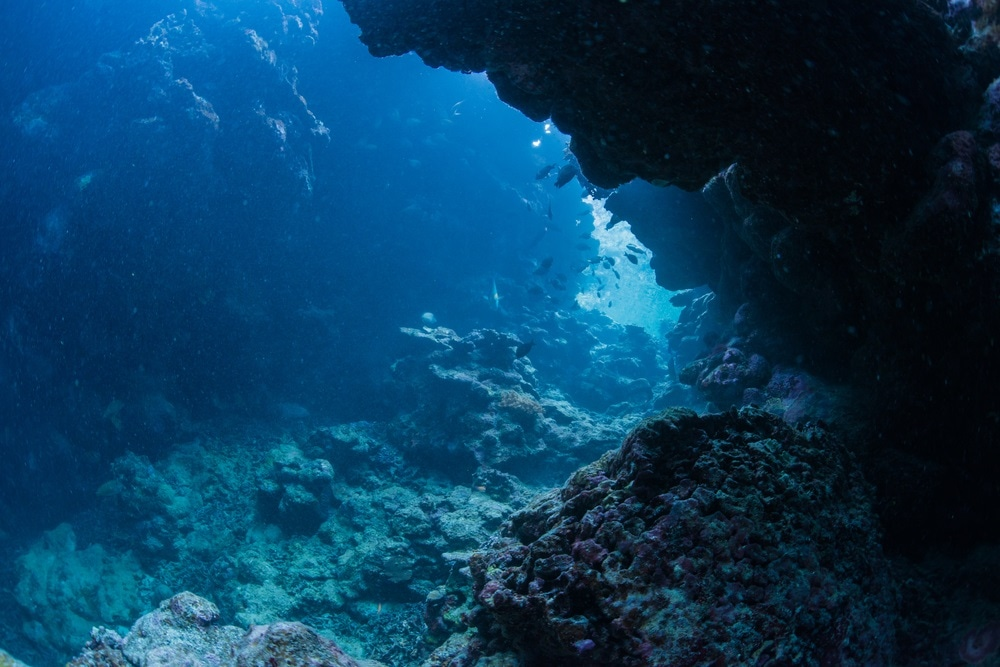

```{r setup, include=FALSE}
knitr::opts_chunk$set(echo = FALSE)
```


Source of the article : <https://www.livescience.com/>

Link of the article : <https://www.livescience.com/65429-amphipods-survive-mariana-trench.html>

Date of publication : 08/05/2019

Word count : 381

(Link of the Plos One article from which this one above was inspired : <https://journals.plos.org/plosone/article/authors?id=10.1371/journal.pone.0206710>)

## Vocabulary 

| Words from the text | Synonym/Explanation               |
| ------------------- | --------------------------------- |
| to suit up in       | to wear                           |
| to dwell            | to live in                        |
| readily             | willingly, without hesitation     |
| sparse              | thinly dispersed, in short supply |

## Analysis table 

|                                                           |                                                                                                                                                                                                                                                                                                                                                                                                                                                                                                                 |
| --------------------------------------------------------- | --------------------------------------------------------------------------------------------------------------------------------------------------------------------------------------------------------------------------------------------------------------------------------------------------------------------------------------------------------------------------------------------------------------------------------------------------------------------------------------------------------------- |
| Author                                                    | Charles Q. Choi, Live Science contributor                                                                                                                                                                                                                                                                                                                                                                                                                                                                       |
| Researchers/Contributors (Original article from Plos One) | Hideki Kobayashi, Hirokazu Shimoshige, Yoshikata Nakajima, Wataru Arai, Hideto Takami                                                                                                                                                                                                                                                                                                                                                                                                                           |
| Published in ? When ?                                     | Live Science, 08/05/2019                                                                                                                                                                                                                                                                                                                                                                                                                                                                                        |
| General topic                                             | Amphipods aren't usually found in deep waters, then how could *H.gigas* possibly survive in such hostile environment as the Mariana trench ? Researchers have discovered that this species' exoskeleton contained aluminum on its surface, which provides chemical protection. First, the crustacean extracts aluminum ions from the seafloor mud that it swallows as it feeds ; then, aluminum ions form a gel in contact with seawater. The gel forms an impermeable barrier over the creature's exoskeleton. |
| Procedure                                                 | Study and observation of *Hirondellea gigas* (Birstein & Vinogradov, 1955), a giant amphipod which can be found in the deep Mariana Trench (collected from the Challenger Deep).                                                                                                                                                                                                                                                                                                                                |
| Conclusion                                                | Hideki Kobayashi said this newfound biological process might one day lead to an environmentally friendly way to produce aluminum.                                                                                                                                                                                                                                                                                                                                                                               |
