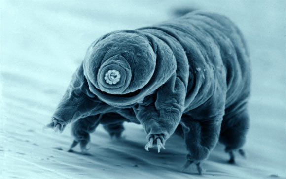

```{r setup, include=FALSE}
knitr::opts_chunk$set(echo = FALSE)
```


Source of the article : <https://www.sciencedaily.com>

Link of the article : <https://www.sciencedaily.com/releases/2019/10/191001102207.htm> or <https://ucsdnews.ucsd.edu/pressrelease/cracking-how-water-bears-survive-the-extremes>

Date of publication : 01/10/2019

Word count : 563

## Vocabulary

| Words from the text | Synonym/Explanation      |
| ------------------- | ------------------------ |
| plump               | full, rounded            |
| chillingly          | frighteningly            |
| feat                | achievement              |
| emeritus            | retired but still titled |

## Analysis table 

|                       |                                                                                                                                                                                                                                                                                  |
| --------------------- | -------------------------------------------------------------------------------------------------------------------------------------------------------------------------------------------------------------------------------------------------------------------------------- |
| Author                | Mario Aguilera                                                                                                                                                                                                                                                                   |
| Researchers           | Carolina Chavez, Grisel Cruz-Becerra, Jia Fei, George A Kassavetis, James T Kadonaga. ("The tardigrade damage suppressor protein binds to nucleosomes and protects DNA from hydroxyl radicals." eLife, 2019)                                                                     |
| Published in ? When ? | Science Daily and UC San Diego News Center, 01/10/2019                                                                                                                                                                                                                           |
| General topic         | Tardigrades, or most commonly called water bears, are extremophilic microorganisms that can survive harsh temperature and pressure conditions. These animals have been the object of lots of studies in order to find what could possibly give them these abilities.             |
| Procedure             | Researchers employed a variety of biochemical techniques to investigate the mechanisms underlying the survivability of tardigrades in the extremes.                                                                                                                              |
| Conclusion            | A protein named Dsup (for Damage suppression protein), which is found only in tardigrades, could be responsible of their resistance faculties. Indeed, Dsup  protects cells by forming a protective cloud that shields DNA from hydroxyl radicals, which are produced by X-rays. |

