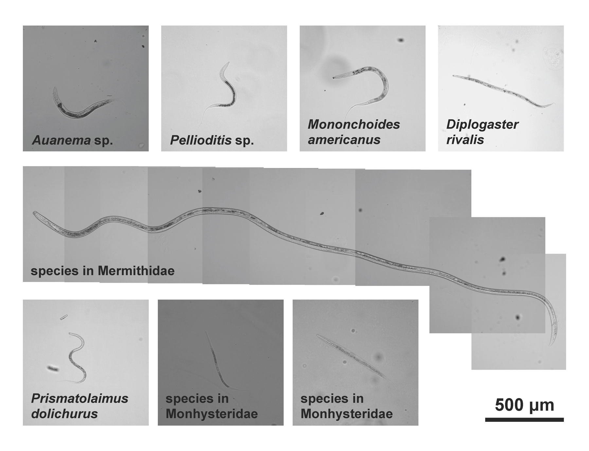

```{r setup, include=FALSE}
knitr::opts_chunk$set(echo = FALSE)
```



Source of the article : <https://www.the-scientist.com/>

Link of the article : <https://www.the-scientist.com/news-opinion/arsenic-resistant-nematodes-found-in-mono-lake-66493>

Date of publication : 26/09/2019

Word count : 811

## Vocabulary

| Words from the text | Synonym/Explanation                             |
| ------------------- | ----------------------------------------------- |
| brine               | water of the sea                                |
| awareness           | mindful, conscious                              |
| harsh               | severe, not pleasant                            |
| shovel              | a hand tool used for taking up or throwing dirt |
| to scoop            | to remove, to gather                            |
| tide                | the regular rise and fall of the waters         |
| to graze            | to feed on grass or other plants                |
| to confer           | to bestow, to give                              |
| broad               | wide                                            |

## Analysis table

|                          |                                                                                                                                                                                                                                                  |
| ------------------------ | ------------------------------------------------------------------------------------------------------------------------------------------------------------------------------------------------------------------------------------------------ |
| Author                   | Abby Olena, science journalist                                                                                                                                                                                                                   |
| Researchers/Contributors | Pei-Yin Shih, James Siho Lee, Ryoji Shinya, Natsumi Kanzaki, Andre Pires-daSilva, Jean Marie Badroos, Elizabeth Groetz, Amir Sapir, Paul W. Stenberg (names found on **Current Biology**, where the research were published)                     |
| Published in ? When ?    | The Scientist, 26/09/2019                                                                                                                                                                                                                        |
| General topic            | Arsenic-resistant nematodes have been found in Mono Lake, a place where few species are able to thrive because of the high arsenic concentration and the salinity.                                                                               |
| Procedure                | Researchers  went to a nematodes collecting trip in Mono Lake (by scooping up the lake soil), and analyzed their genomes.                                                                                                                        |
| Conclusion               | Researchers collected 8 species of nematodes, including 5 which haven't been described yet. It has also been said that these species can thrive into such environments thanks to a mutation of a gene that is involved in amino acid metabolism. |
