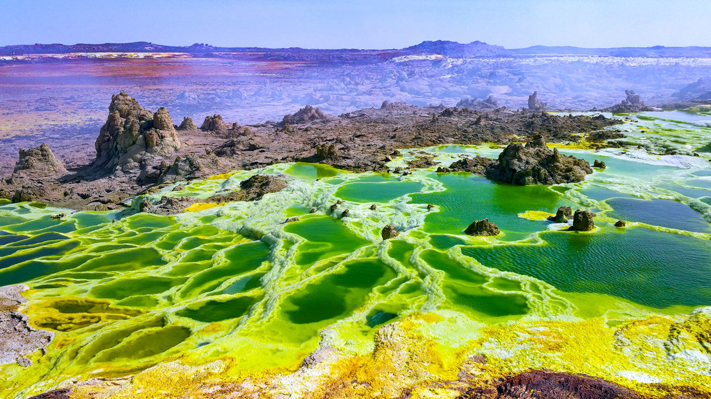

```{r setup, include=FALSE}
knitr::opts_chunk$set(echo = FALSE)
```



Source of the article : <https://science.sciencemag.org/>

Link of the article : <https://www.sciencemag.org/news/2019/10/some-spots-earth-are-too-hostile-life#>

Date of publication : 28/10/2019

Word count : 572

## Vocabulary

| Words from the text | Synonyms/Explanation                  |
| ------------------- | ------------------------------------- |
| scalding            | burning                               |
| to pinpoint         | to describe exactly                   |
| to contradict       | to say the opposite                   |
| to vent             | to release, to discharge              |
| lowland soils       |  low leveled compared to nearby lands |

## Analysis table

|                          |                                                                                                                  |
| ------------------------ | ---------------------------------------------------------------------------------------------------------------- |
| Author                   | Elizabeth Pennisi, Science journalist, specialized in genomics, evolution, microbiology, and organismal biology  |
| Researchers/Contributors | Purificación López-García et al.,  Nicholas Dragone et al.                                                       |
| Published in ? When ?    | Science mag, 28/10/2019                                                                                          |
| General topic            |                                                                                                                  |
| Procedure                |                                                                                                                  |
| Conclusion               |                                                                                                                  |
